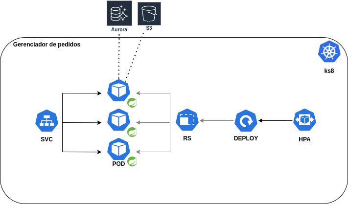

Projeto criado para abrigar o projeto de Tech Challenge do curso de Arquitetura de Software da Fiap. 

Esse projeto consiste num sistema de gerenciamento de pedidos de uma lanchoete fast food com auto atendimento. 
## Requisitos

Principais Dependências
* SpringBoot
* Gradle
* Postgres database
* Swagger


**Note**
Lombok e dependências de framework não estão sendo usados na camada de domínio da aplicação! 

## Padrões utilizados
* Arquitetura limpa
* DDD

**Warning**
O projeto ainda está em desenvolvimento, existem comentários de to-dos principalmente nas classes de entidade e valueobjects da camada de domínio. 
Portanto, mesmo que algumas classes ainda possam parecer anêmicas, a estrutura já foi criada para que regras de negócio que serão implementadas mudem o cenário. 

## Arquitetura atual


## 
[Vídeo explicando arquitetura](https://youtu.be/Gee_SbATWFo)

## Rodando o projeto com docker-compose
#Você vai precisar:

* Docker e docker-compose instalados na sua máquina

Clone o projeto e execute o comando

	$ docker-compose up

## Rodando o projeto em um cluster kubernetes
#Você vai precisar:
* Minikube instalado 
* Kubectl configurado
* Subir um banco postgres ([Sugestão via helm](https://fusionauth.io/docs/get-started/download-and-install/kubernetes/minikube)
  )

## Endpoints
Existem 13 apis públicas, todas podem ser acessadas através do link do swagger: http://localhost:8080/swagger-ui/index.html#/

Caso prefira, também pode importar a collection do postman, que se encontra na raiz desse projeto. 
## Ordem sugerida de execução das chamadas na API

- Criar produto
```
POST localhost:8080/api/v1/products
{
    "name":"Guarana Artemis",
    "description":"Guarana Artemis - Refrigerante",
    "category":"BEBIDA",
    "price":"5.0",
    "images" : ["https://gerenciador-pedidos-lanchonete.s3.amazonaws.com/artemis.png"]
}
Response
HTTP Status 201 Created
{
  id: "12c3009d-046d-411c-85eb-6e379e2f5d2a"
}
```
- Checkout pedido
```
POST localhost:8080/api/v1/orders
{
    "items": [
        {
            "quantity": 3,
            "productId": "12c3009d-046d-411c-85eb-6e379e2f5d2a",
            "price":"5.0",
            "subtotal":"15.0"
        }
    ]
}
HTTP Status 201 Created
{
    "id": "c28ad3b9-c1cd-497f-8dd0-8724bc2f658c",
    "pickupCode": 1,
    "paymentId": "c1519ab3-7d83-4a97-8d75-3f69bd0754b8"
}
```
**Nota**
Na request acima, o preço e subtotal são enviados, mas esses valores serão validados no backend
- Atualizar status pagamento
```
PATCH localhost:8080/api/v1/payments/c1519ab3-7d83-4a97-8d75-3f69bd0754b8
{
    "items": [
        {
            "quantity": 3,
            "productId": "f3324c67-35db-43c8-9dfe-db520d6b67d7",
            "price":"5.0",
            "subtotal":"15.0"
        }
    ]
}
HTTP Status 204 No Content
```
- Atualizar status pedido

```
PATCH localhost:8080/api/v1/orders/c28ad3b9-c1cd-497f-8dd0-8724bc2f658c
{
    "items": [
        {
            "quantity": 3,
            "productId": "12c3009d-046d-411c-85eb-6e379e2f5d2a",
            "price":"5.0",
            "subtotal":"15.0"
        }
    ]
}
HTTP Status 204 No Content
```
- Listar pedidos (segundo ordem do requisito do projeto e ignorando Finalizados)

```
GET  localhost:8080/api/v1/orders

Response
HTTP Status 200
{
    "orders": [
        {
            "id": "c28ad3b9-c1cd-497f-8dd0-8724bc2f658c",
            "price": 15.00,
            "pickUpCode": 1,
            "orderStatus": "CRIADO",
            "items": [
                {
                    "id": 1,
                    "productId": "d5dd6581-734f-4c1c-85a8-64e465af7aa1",
                    "subTotal": 15.00,
                    "quantity": 3
                }
            ]
        }
    ]
}

```


